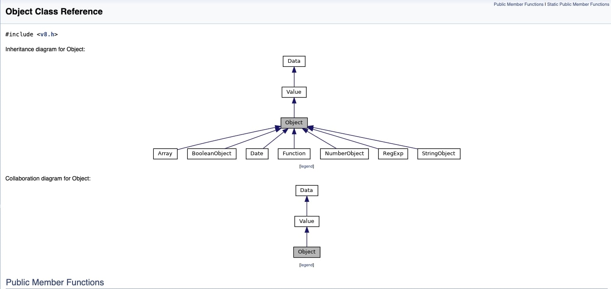

# Introduction



We know that `typeof []` is `object` in JavaScript, and we know that `typeof {}` is `object` too.

So, how to distinguish them?

Maybe you think that `Array.isArray` is a good way. Very good :)

If you don't have it ? I asked this to a friend, and he said: "Just check the `length` property".

```js
const test = {}

if(!test?.length) {
  console.log('not an array')
} else {
  console.log('is array')
}
```

So, Javascript do something like this of course, just check if the object has a `length` property, or try do some magic in `__proto__`.

But i was sure that JS has a better way to do this, and i found it.

First of all, if you type `Array` in console, you will see something like this:

```js
function Array() { [native code] }
```

Also, if you type `Object` in console, you will see something like this:

```js
function Object() { [native code] }
```

So, `Array` and `Object` are native code, written in C++ on V8 engine.

Let's try find this header file in V8 source code.

https://v8docs.nodesource.com/node-0.8/dc/d0a/classv8_1_1_value.html#a4c55485457c6318b9f4a7c59530c8094

Great, now we can see that we have the header file, and we can see the `IsArray` method.

```cpp
V8EXPORT bool IsArray	(		)	const
```

I just clone the V8 source code, if you want to deep dive with me, you can clone it too.

or access it online:

https://github.dev/v8/v8

Now, we can see the `IsArray` method in `src/api/api.cc` file.

```cpp
bool Value::IsArray() const {
  return IsJSArray(*Utils::OpenDirectHandle(this));
}
```

So, we can see that `IsArray` method is just a wrapper of `IsJSArray` method.

Let's find it. 

src/codegen/code-stub-assembler.h
```cpp
TNode<BoolT> IsJSArray(TNode<HeapObject> object);
```

But i want the implementation, so i search for `IsJSArray` in the source code.

src/codegen/code-stub-assembler.cc
```cpp
TNode<BoolT> CodeStubAssembler::IsJSArray(TNode<HeapObject> object) {
  return IsJSArrayMap(LoadMap(object));
}
```

Wow, we are getting closer, now we can see that `IsJSArray` is just a wrapper of `IsJSArrayMap`.

Let's find it.

src/codegen/code-stub-assembler.cc
```cpp
TNode<BoolT> CodeStubAssembler::IsJSArrayMap(TNode<Map> map) {
  return IsJSArrayInstanceType(LoadMapInstanceType(map));
}
```

Now, we can see that `IsJSArrayMap` is just a wrapper of `IsJSArrayInstanceType`.

Let's find it.

src/codegen/code-stub-assembler.cc
```cpp
TNode<BoolT> CodeStubAssembler::IsJSArrayInstanceType(
    TNode<Int32T> instance_type) {
  return InstanceTypeEqual(instance_type, JS_ARRAY_TYPE);
}
```

More closer, now we have a `InstanceTypeEqual` method. the instance type is just a number, and we can see that `JS_ARRAY_TYPE` is just a number too.

How do i know it?

some reason:

1 - Check the src/compiler/types.cc

```cpp
...
case JS_ARRAY_TYPE:
      return kArray;
...
```

2 - Check the src/profiler/heap-snapshot-generator.h

```cpp
class HeapEntry {
 public:
  enum Type {
    ....
    kArray = v8::HeapGraphNode::kArray,
    ....
  };
```

3 - finally, check the include/v8-profiler.h

```cpp
class V8_EXPORT HeapGraphNode {
 public:
  enum Type {
    ....
    kArray = 1,          // An array of elements.
    ....
  };
```

So, we can see that `JS_ARRAY_TYPE` is just a number, and this number is `1`.

Now, we can see that `IsJSArrayInstanceType` is just a wrapper of `InstanceTypeEqual`.

Let's find it.

src/codegen/code-stub-assembler.cc
```cpp
TNode<BoolT> CodeStubAssembler::InstanceTypeEqual(TNode<Int32T> instance_type,
                                                  int type) {
  return Word32Equal(instance_type, Int32Constant(type));
}
```

I think we dont need to go deeper more than this.

As we know that Object and Array have different instance type ( or signature ).

In the end of day, these builtins classes are fundamental components of the JavaScript runtime environment provided by the V8 engine.

By having these functions implemented in C++, the V8 engine can execute them much faster than if they were implemented in JavaScript itself, which is important for overall JavaScript performance.

